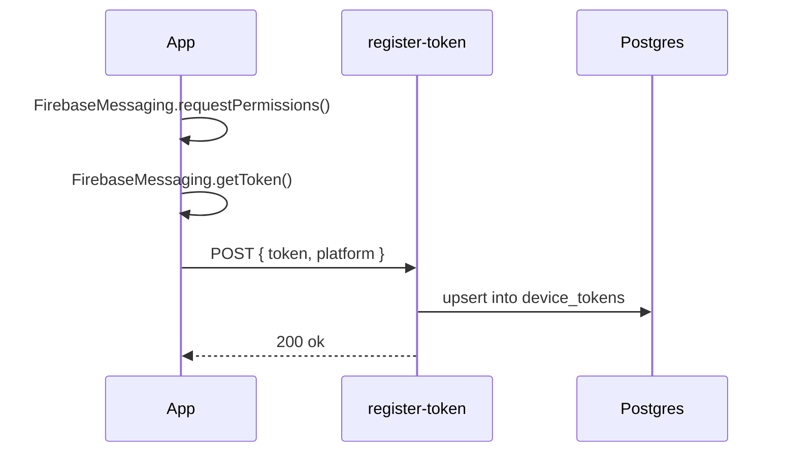
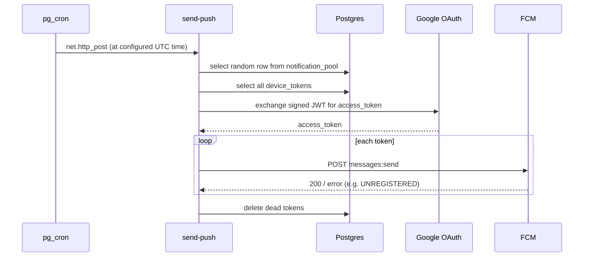

There are two types of notifications:
### Bahr-e-aam/urs notifications:
- This is user specific notifications, each user have different Murshid, so this is Murshid-based.
- scheduled via push notifications


### Daily ayahs, hadees and naql notifs:
- similar to daily quotes
- full working below.

1. Summary

The app ships a bundled set of `{ key, body }` content pairs. At fixed times every day, the user should receive a push notification showing one randomly-picked pair as `title` / `body`. This must work without the app ever being reopened, and without any client-side background service.

Random selection and delivery are pushed entirely server-side. The client's only responsibility is registering a device token once.

 2. Goals / Non-Goals

**Goals**

- Deliver N notifications/day at fixed times, content picked randomly server-side, no caps on how far out delivery can be scheduled.
- Zero reliance on the app being opened, backgrounded-refreshed, or running any local scheduling logic.
- Same random Naql
- $0 infrastructure cost, no billing account / credit card requirement.

**Non-Goals**

- No local notification scheduling, no `@capacitor/local-notifications`, no `@capacitor/background-runner`. (Superseded — see [Alternatives considered](#10-alternatives-considered).)
- No per-user personalization of content (single shared pool for now).
- No in-app notification inbox / read-state tracking.

 3. Architecture Overview

```
┌─────────────┐   register token    ┌──────────────────────┐
│ Capacitor   │ ───────────────────▶│ Edge Fn: register-    │
│ app         │                     │ token                 │
│             │                     └──────────┬────────────┘
│ (FCM token  │                                │ upsert
│  via        │                                ▼
│  @capacitor-│                     ┌──────────────────────┐
│  firebase/  │                     │ Postgres              │
│  messaging) │                     │  - device_tokens       │
└─────────────┘                     │  - notification_pool   │
      ▲                             └──────────┬────────────┘
      │ push delivered                          │ read
      │ (APNs / FCM channel)                     ▼
      │                             ┌──────────────────────┐
      └─────────────────────────────│ Edge Fn: send-push     │
                                     │  1. pick random pair   │
                                     │  2. mint FCM OAuth tok │
                                     │  3. POST per token     │
                                     │  4. purge dead tokens  │
                                     └──────────┬────────────┘
                                                │ invoked by
                                                ▼
                                     ┌──────────────────────┐
                                     │ pg_cron + pg_net       │
                                     │ (fires at configured   │
                                     │  UTC times daily)      │
                                     └──────────────────────┘
```

Firebase's only role in this system is FCM delivery. No Cloud Functions, no Blaze plan, no billing account.

 4. Components

 4.1 Client

- Plugin: `@capacitor-firebase/messaging` (unified FCM token on both iOS and Android — the plain `@capacitor/push-notifications` plugin returns a raw APNs token on iOS that FCM can't target directly).
- Responsibility: request permission, fetch token, POST it to `register-token` once on launch and again on `tokenReceived`.
- Content pool JSX → plain text conversion happens upstream of this system (existing helper functions) — `notification_pool` only ever stores plain strings.

 4.2 Firebase project (FCM delivery only)

- Spark (free) plan — sufficient, since Cloud Functions are never used here.
- Android app registered → `google-services.json`.
- iOS app registered → `GoogleService-Info.plist` + APNs `.p8` Auth Key uploaded under Cloud Messaging.
- Service account JSON (Project Settings → Service Accounts → Generate key) is the credential `send-push` uses to authenticate to FCM — stored as a Supabase secret, never shipped to the client.

4.3 Supabase Postgres — data layer

Two tables, both accessed only via `service_role` from within Edge Functions (never exposed to the client directly).

 4.4 Supabase Edge Functions

- `register-token` — public-ish write endpoint, upserts a device token.
- `send-push` — the actual worker. Not invoked by the client at all; only by pg_cron.

 4.5 pg_cron + pg_net

- `pg_cron`: Postgres extension, enabled by default on Supabase, runs SQL on a schedule.
- `pg_net`: lets that scheduled SQL fire an async HTTP call — this is what actually triggers `send-push`.
- Runs in UTC; see [§8](#8-scheduling-configuration) for local-time conversion.

 5. Data Model

```sql
create table device_tokens (
  token         text primary key,
  platform      text,                 -- 'ios' | 'android'
  last_seen_at  timestamptz default now()
);

create table notification_pool (
  id    uuid primary key default gen_random_uuid(),
  key   text not null,                -- notification title
  body  text not null                 -- notification body, plain text
);
```

No table for "sent history" in v1 — not needed since content isn't sequential or user-specific. Add one later if analytics/dedup-across-days becomes a requirement.

 6. Request Flows

 6.1 Token registration



```ts
// supabase/functions/register-token/index.ts
import { createClient } from 'npm:@supabase/supabase-js@2';

Deno.serve(async (req) => {
  const { token, platform } = await req.json();
  const supabase = createClient(
    Deno.env.get('SUPABASE_URL')!,
    Deno.env.get('SUPABASE_SERVICE_ROLE_KEY')!
  );
  await supabase.from('device_tokens').upsert(
    { token, platform, last_seen_at: new Date().toISOString() },
    { onConflict: 'token' }
  );
  return new Response('ok');
});
```

Client call site:

```ts
await fetch('https://<project-ref>.supabase.co/functions/v1/register-token', {
  method: 'POST',
  headers: { 'Content-Type': 'application/json' },
  body: JSON.stringify({ token, platform: Capacitor.getPlatform() }),
});
```

 6.2 Scheduled send



```ts
// supabase/functions/send-push/index.ts
import { createClient } from 'npm:@supabase/supabase-js@2';

const SA = JSON.parse(Deno.env.get('FIREBASE_SERVICE_ACCOUNT')!);

function b64url(input: ArrayBuffer | string) {
  const bytes = typeof input === 'string' ? new TextEncoder().encode(input) : new Uint8Array(input);
  return btoa(String.fromCharCode(...bytes)).replace(/\+/g, '-').replace(/\//g, '_').replace(/=+$/, '');
}

async function getAccessToken() {
  const now = Math.floor(Date.now() / 1000);
  const unsigned = `${b64url(JSON.stringify({ alg: 'RS256', typ: 'JWT' }))}.${b64url(JSON.stringify({
    iss: SA.client_email,
    scope: 'https://www.googleapis.com/auth/firebase.messaging',
    aud: 'https://oauth2.googleapis.com/token',
    iat: now, exp: now + 3600,
  }))}`;
  const pem = SA.private_key.replace(/-----[^-]+-----|\n/g, '');
  const key = await crypto.subtle.importKey(
    'pkcs8', Uint8Array.from(atob(pem), c => c.charCodeAt(0)),
    { name: 'RSASSA-PKCS1-v1_5', hash: 'SHA-256' }, false, ['sign']
  );
  const sig = await crypto.subtle.sign('RSASSA-PKCS1-v1_5', key, new TextEncoder().encode(unsigned));
  const res = await fetch('https://oauth2.googleapis.com/token', {
    method: 'POST',
    headers: { 'Content-Type': 'application/x-www-form-urlencoded' },
    body: `grant_type=urn:ietf:params:oauth:grant-type:jwt-bearer&assertion=${unsigned}.${b64url(sig)}`,
  });
  return (await res.json()).access_token as string;
}

Deno.serve(async () => {
  const supabase = createClient(Deno.env.get('SUPABASE_URL')!, Deno.env.get('SUPABASE_SERVICE_ROLE_KEY')!);
  const { data: pool } = await supabase.from('notification_pool').select('key, body');
  const { data: tokens } = await supabase.from('device_tokens').select('token');
  if (!pool?.length || !tokens?.length) return new Response('nothing to send');

  const pick = pool[Math.floor(Math.random() * pool.length)];
  const accessToken = await getAccessToken();
  const dead: string[] = [];

  for (const { token } of tokens) {
    const res = await fetch(`https://fcm.googleapis.com/v1/projects/${SA.project_id}/messages:send`, {
      method: 'POST',
      headers: { Authorization: `Bearer ${accessToken}`, 'Content-Type': 'application/json' },
      body: JSON.stringify({
        message: { token, notification: { title: pick.key, body: pick.body }, data: { key: pick.key } },
      }),
    });
    if (!res.ok) {
      const err = await res.json().catch(() => null);
      if (err?.error?.status === 'UNREGISTERED' || res.status === 404) dead.push(token);
    }
  }
  if (dead.length) await supabase.from('device_tokens').delete().in('token', dead);
  return new Response('ok');
});
```

Deploy:

```bash
supabase secrets set FIREBASE_SERVICE_ACCOUNT="$(cat service-account.json)"
supabase functions deploy register-token --no-verify-jwt
supabase functions deploy send-push
```

7. FCM Authentication

FCM's v1 API requires an OAuth2 access token minted from the service account — there is no static server key anymore. `firebase-admin` is deliberately **not** used here: its auth internals depend on Node built-ins (`child_process`, etc.) that don't exist in the Deno runtime Edge Functions run on, and fail at deploy time. Instead, `getAccessToken()` builds and RS256-signs the JWT by hand using the Web Crypto API (`crypto.subtle`), then trades it for an access token at Google's token endpoint. Zero external dependencies.

8. Scheduling Configuration

`pg_cron` runs in UTC. Convert each desired IST send time (UTC+5:30) before scheduling:

|Desired time (IST)|Cron UTC time|Cron expression|
|---|---|---|
|09:00|03:30|`30 3 * * *`|
|20:00|14:30|`30 14 * * *`|

Secrets (function URL, service-role key) are kept in Supabase Vault rather than pasted into the schedule body, since `cron.job` / `cron.job_run_details` are otherwise plaintext-visible:

```sql
select vault.create_secret('https://<project-ref>.supabase.co/functions/v1/send-push', 'push_url');
select vault.create_secret('<service-role-key>', 'push_auth');

select cron.schedule(
  'push-morning',
  '30 3 * * *',
  $$
  select net.http_post(
    url := (select decrypted_secret from vault.decrypted_secrets where name = 'push_url'),
    headers := jsonb_build_object(
      'Authorization', 'Bearer ' || (select decrypted_secret from vault.decrypted_secrets where name = 'push_auth'),
      'Content-Type', 'application/json'
    )
  );
  $$
);

select cron.schedule(
  'push-evening',
  '30 14 * * *',
  $$
  select net.http_post(
    url := (select decrypted_secret from vault.decrypted_secrets where name = 'push_url'),
    headers := jsonb_build_object(
      'Authorization', 'Bearer ' || (select decrypted_secret from vault.decrypted_secrets where name = 'push_auth'),
      'Content-Type', 'application/json'
    )
  );
  $$
);
```

9. Failure Handling

|Failure|Handling|
|---|---|
|FCM returns `UNREGISTERED` / 404 for a token|Token added to `dead` list, deleted from `device_tokens` at end of run|
|`pg_net` call fails (5xx, timeout)|Fire-and-forget — no automatic retry. Visible in `net._http_response`. Acceptable at this scale; add a retry job later if needed.|
|Service account `project_id` mismatch|Silent iOS-only failure (APNs key uploaded to wrong Firebase project). No automated detection — verify manually during setup.|
|`notification_pool` or `device_tokens` empty|`send-push` short-circuits and returns early, no-op.|

10. Observability

```sql
-- did the cron job fire, and what happened
select * from cron.job_run_details order by start_time desc limit 5;

-- what did the HTTP call to send-push actually return
select * from net._http_response order by created desc limit 5;
```

Manual invoke, bypassing cron entirely, for testing:

```bash
supabase functions invoke send-push
```

11. Setup Checklist

- [ ] Firebase project created, Android + iOS apps registered
- [ ] APNs `.p8` key uploaded to Firebase Cloud Messaging settings
- [ ] Service account JSON downloaded
- [ ] `@capacitor-firebase/messaging` installed, client registration wired up
- [ ] `notification_pool` seeded with initial content
- [ ] `register-token` and `send-push` deployed
- [ ] `FIREBASE_SERVICE_ACCOUNT` secret set
- [ ] Vault secrets created (`push_url`, `push_auth`)
- [ ] `cron.schedule` jobs created for each daily time
- [ ] End-to-end test via `supabase functions invoke send-push` on a real device

12. Cost

$0 at this scale. No billing account required anywhere in this stack — Supabase free tier covers Edge Functions + pg_cron, FCM is free on Firebase's Spark plan. Contrast with the Firebase Cloud Functions alternative, which forces the Blaze (pay-as-you-go) plan and a card on file even though usage-based cost stays at $0.

 13. Alternatives Considered

- **Local notifications, batch-scheduled + `@capacitor/background-runner` top-up** — fully on-device, no backend at all. Rejected in favor of this design for cleanliness: iOS caps pending local notifications at 64, requiring batch-refill logic, and `BGTaskScheduler` execution is opportunistic (not guaranteed timing). This push-based design has no such cap and no dependency on the app ever being opened.
- **Firebase Cloud Functions (`onSchedule`) instead of Supabase** — functionally equivalent, simpler code (real `firebase-admin` SDK, no manual JWT signing) but requires the Blaze plan and a card on file. Rejected for this project given the $0 / no-billing-account constraint.
- **True background service (Android foreground service / iOS background execution)** — not viable. iOS has no general-purpose "run continuously" mechanism for a non-exempt app category. Android's foreground service would work but requires a permanent visible notification and Play Store policy justification for a use case (`specialUse`) that doesn't clearly qualify.

14. Open Questions / Future Work

- Multi-timezone support if the user base isn't India-only (currently hardcoded UTC offsets in cron expressions).
- Retry logic for failed `pg_net` calls.
- Per-user content history to avoid repeats within N days.
- Rich notification support (images) if the content pool grows to include them.